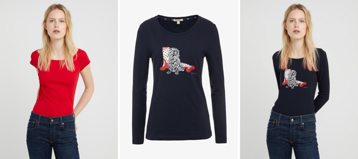

# CatVTON for FLUX — training-free virtual try-on (Modular Diffusers custom block)

Put a garment on a person from **one photo each** — no fine-tuning — as a
[Modular Diffusers](https://huggingface.co/docs/diffusers/main/en/modular_diffusers/custom_blocks)
custom block. Implements **CatVTON** ([arXiv:2407.15886](https://arxiv.org/abs/2407.15886), *"Concatenation
Is All You Need"*) on **FLUX.1-Fill**: the garment and person are concatenated into one latent canvas and the
person's clothing region is inpainted conditioned on the garment — so the reference garment is injected into
the diffusion **context** by concatenation (which preserves logo/pattern/cut, where a cross-attention feed
would only give loose style).

[](https://colab.research.google.com/drive/1ADzHQRDOq1z_giqy6-9Sv032Fw3tIzhI?usp=sharing) — upload a photo of a person + a garment and try it on.



<sub>person · garment · try-on — the garment (navy long-sleeve, graphic) is transferred; pose and lower-body preserved. Training-free.</sub>

## Usage

```python
import torch
from diffusers import ModularPipeline

pipe = ModularPipeline.from_pretrained("remyxai/catvton-flux-modular", trust_remote_code=True)
pipe.load_components(dtype=torch.bfloat16)
pipe.to("cuda")

tryon = pipe(
    person_image="person.jpg",     # a photo of the person
    garment_image="shirt.jpg",     # the garment to wear
    # mask=...                      # optional; auto-generated from the person if omitted
    height=768, width=576, guidance_scale=30, num_inference_steps=30,
).images[0]
tryon.save("tryon.png")
```

**Dependencies:** `pip install transformers accelerate peft timm opencv-python`. On first run it downloads
FLUX.1-Fill-dev, the CatVTON LoRA (`xiaozaa/catvton-flux-lora-alpha`), and a clothes-parsing model
(`mattmdjaga/segformer_b2_clothes`) for the agnostic mask. Pass your own `mask` to skip the auto-masker.

## How it works

- **Concatenation, not cross-attention** — `[garment | person]` are placed side-by-side on one canvas; the
  person's clothing region is masked and inpainted by **FLUX.1-Fill** conditioned on the unmasked garment half.
  The try-on is the right half of the result. This is what preserves garment fidelity.
- **CatVTON LoRA** — `xiaozaa/catvton-flux-lora-alpha` (FID 6.07 on VITON-HD) is loaded into the FLUX-Fill
  transformer; the base weights are otherwise untouched.
- **Auto agnostic mask** — a segformer clothes-parser marks the person's upper garment **plus the arms** (so
  sleeves can form) and excludes the lower body (so the pants are preserved), filled to a solid region.

## Key parameters

| arg | default | meaning |
|---|---|---|
| `person_image` | — | photo of the person |
| `garment_image` | — | the garment to try on |
| `mask` | `None` | optional agnostic mask (white = replace); auto-generated if omitted |
| `guidance_scale` | 30 | CatVTON's recommended scale |
| `num_inference_steps` | 30 | denoise steps |
| `height`, `width` | 768, 576 | person/garment size; the internal canvas is 2×width |

## Attribution & AI assistance

Training-free reimplementation for Modular Diffusers of **CatVTON**
([nftblackmagic/catvton-flux](https://github.com/nftblackmagic/catvton-flux), MIT; LoRA
`xiaozaa/catvton-flux-lora-alpha`) on **FLUX.1-Fill-dev**; the agnostic mask uses
[`mattmdjaga/segformer_b2_clothes`](https://huggingface.co/mattmdjaga/segformer_b2_clothes). The
Modular-Diffusers adaptation was authored with AI assistance (Claude) and validated by the Remyx AI team;
method credit to the CatVTON authors. Uses FLUX.1-dev / FLUX.1-Fill-dev under their **non-commercial** license.

## Citation

```bibtex
@misc{chong2024catvton,
  title={CatVTON: Concatenation Is All You Need for Virtual Try-On with Diffusion Models},
  author={Chong, Zheng and Dong, Xiao and Li, Haoxiang and Zhang, Shiyue and Zhang, Wenqing and Zhang, Xujie and Zhao, Hanqing and Jiang, Dongmei and Liang, Xiaodan},
  year={2024}, eprint={2407.15886}, archivePrefix={arXiv}, primaryClass={cs.CV},
  url={https://arxiv.org/abs/2407.15886}
}
```
