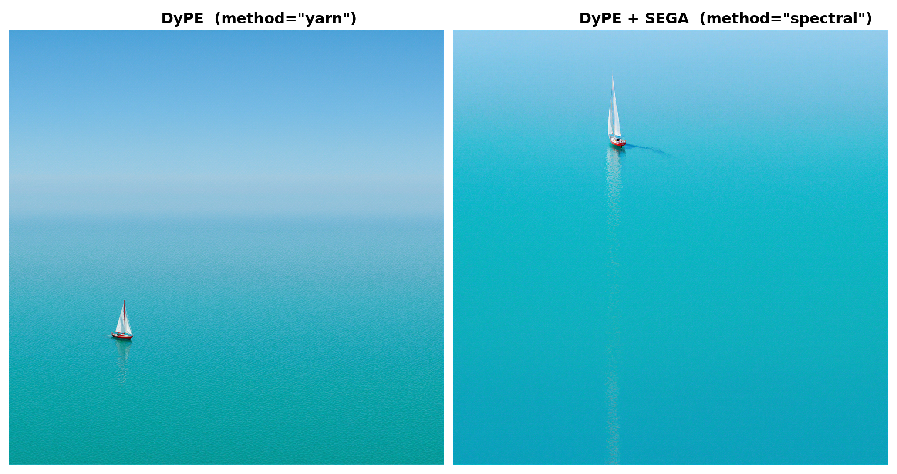
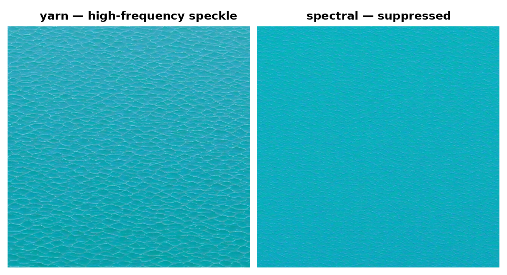

# DyPE for FLUX — training-free ultra-high-resolution (Modular Diffusers custom block)

**🤗 Hub:** [remyxai/dype-flux-modular](https://huggingface.co/remyxai/dype-flux-modular) · **📄 Paper:** [arXiv:2510.20766](https://arxiv.org/abs/2510.20766) · **💻 Reference:** [guyyariv/DyPE](https://github.com/guyyariv/DyPE) · **📦 Monorepo:** [flux-recipes](https://github.com/remyxai/flux-recipes)

Training-free text-to-image up to 4096² from off-the-shelf **FLUX.1-Krea-dev** — no fine-tuning, no extra
weights, **single pass** — packaged as a
[Modular Diffusers](https://huggingface.co/docs/diffusers/main/en/modular_diffusers/custom_blocks)
custom block. Load it and generate in three lines.


<sub>4096² from stock FLUX.1-Krea-dev, training-free, `method="spectral"`.</sub>

## Why training-free high-res?

Ask stock FLUX for a 4096² image **directly** and it collapses — at 65k tokens the flow-match sigma
schedule blows up and the denoiser never denoises (a "woven blob"). DyPE
([arXiv:2510.20766](https://arxiv.org/abs/2510.20766)) fixes this at **inference**, in a single pass: a
**timestep-dynamic** YaRN/NTK-by-parts RoPE schedule (strength κ=t², strongest early when global
structure is set, fading as detail resolves) plus the flow-match shift cap that keeps the schedule sane
at high token counts. No ladder, no fine-tuning.

## Usage

```python
import torch
from diffusers import ModularPipeline

pipe = ModularPipeline.from_pretrained("remyxai/dype-flux-modular", trust_remote_code=True)
pipe.load_components(dtype=torch.bfloat16)
pipe.to("cuda")

image = pipe(
    prompt="a clear blue sky over a calm turquoise sea, a lone red sailboat",
    height=4096, width=4096,
    guidance_scale=4.5,
    method="spectral",          # "yarn" = DyPE · "spectral" = DyPE + SEGA (less speckle)
).images[0]
image.save("dype_4k.png")
```

The FLUX.1-Krea-dev transformer / VAE / text-encoders stream from the base repo — nothing is duplicated
here. VAE tiling is enabled automatically (at 4K the VAE encode/decode dominates memory).

## The speckle fix: `yarn` vs `spectral` (SEGA)

DyPE alone leaves a faint high-frequency **speckle** in flat regions — a genuine artifact of its scalar
attention-temperature at high resolution. `method="spectral"` swaps that scalar for a **per-frequency,
content-aware** attention temperature derived from the latent's Fourier spectrum each step (SEGA,
[arXiv:2605.22668](https://arxiv.org/abs/2605.22668)) — it suppresses the high-frequency band
*selectively*, so the speckle goes without softening real detail.



Same flat water region, native resolution — the woven speckle (left) is gone under spectral (right):



Because SEGA modulates attention every step, it also shifts composition at a fixed seed — it is an
**alternate mode**, not a pixel-match of `yarn`. Use `spectral` for clean flat regions (skies, water,
walls); `yarn` reproduces plain DyPE.

## How it works

DyPE is applied by swapping the transformer's positional-embedding module for a dynamic one and feeding
it the current timestep (and, in `spectral` mode, the running latent's spectral profile) via a native
forward pre-hook — no changes to the base weights, restored on exit.

- **Dynamic YaRN / NTK-by-parts RoPE** — extends the trained position band to the high-res grid, scaled
  by κ=t² so extrapolation is strongest early and fades as the image resolves (the core DyPE mechanism).
- **Flow-match shift cap** — caps the schedule shift (`mu = max_shift`) so the sigma schedule stays sane
  at 65k tokens; required for any single-pass >2K FLUX generation.
- **SEGA spectral mode** (optional) — per-RoPE-dimension attention temperature from the latent's FFT
  energy profile; the selective high-frequency fix above.

Unlike a resolution-ladder approach, DyPE is **single-pass** — one denoise at the target resolution.
DyPE's RoPE schedule in this block is verified **bit-exact** against the reference implementation; the
pipeline produces coherent 4K where stock FLUX collapses, and `spectral` suppresses the speckle (shown
above).

## Key parameters

| arg | default | meaning |
|---|---|---|
| `height`, `width` | 1024 | target resolution (multiples of 16); DyPE engages above 1024² |
| `method` | `"yarn"` | `"yarn"` = DyPE · `"spectral"` = DyPE + SEGA |
| `guidance_scale` | 4.5 | FLUX.1-Krea-dev's realism range |
| `num_inference_steps` | 28 | denoise steps |
| `dype` | `True` | set `False` to A/B against the (blob-prone) stock path |

## Running on less VRAM

A 4096² generation peaks **~49.8 GB (bf16)** with VAE tiling on an A100. The same 4-bit recipe proven for
the sibling [HRDiT block](https://huggingface.co/remyxai/hrdit-flux-modular#running-on-less-vram-4-bit)
applies here — quantize the transformer + T5 to **NF4** and swap them in with `update_components` — which
brought that pipeline to ~29 GB @ 4096² / ~16 GB @ 2048²; the DyPE-specific measurement is a pending
follow-up. At any resolution, keep `pipe.vae.enable_tiling()` (on by default here).

## Attribution & AI assistance

Training-free reimplementation for Modular Diffusers of **DyPE** (MIT,
[guyyariv/DyPE](https://github.com/guyyariv/DyPE)); the `spectral` mode adapts **SEGA** from
[wildminder/ComfyUI-DyPE](https://github.com/wildminder/ComfyUI-DyPE) (Apache-2.0). The Modular-Diffusers
adaptation was authored with AI assistance (Claude) and reviewed + validated by the Remyx AI team; all
credit for the methods goes to the original authors.

## Citation

```bibtex
@misc{issachar2026dype,
  title={DyPE: Dynamic Position Extrapolation for Ultra High Resolution Diffusion},
  author={Issachar, Noam and Yariv, Guy and Benaim, Sagie and Adi, Yossi and Lischinski, Dani and Fattal, Raanan},
  year={2026},
  eprint={2510.20766},
  archivePrefix={arXiv},
  primaryClass={cs.CV},
  url={https://arxiv.org/abs/2510.20766}
}
```
