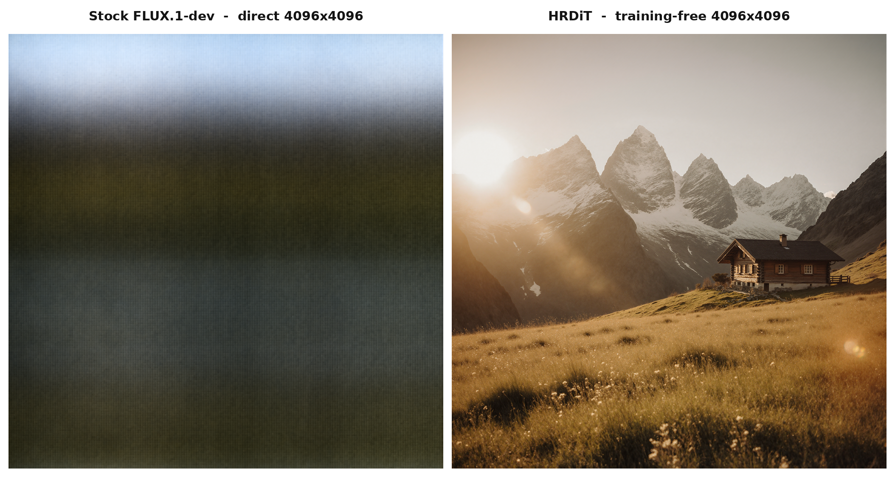

# HRDiT for FLUX — training-free 4K (Modular Diffusers custom block)

**🤗 Hub:** [remyxai/hrdit-flux-modular](https://huggingface.co/remyxai/hrdit-flux-modular) · **📄 Paper:** [arXiv:2608.07003](https://arxiv.org/abs/2608.07003) · **💻 Reference:** [zylwithxy/HRDiT](https://github.com/zylwithxy/HRDiT) · **📦 Monorepo:** [flux-recipes](https://github.com/remyxai/flux-recipes)

Training-free high-resolution text-to-image (up to 4096²) from off-the-shelf **FLUX.1** checkpoints —
no fine-tuning, no extra weights — packaged as a
[Modular Diffusers](https://huggingface.co/docs/diffusers/main/en/modular_diffusers/custom_blocks)
custom block. Load it and generate in three lines.


<sub>4096² from stock FLUX.1-dev, training-free · [full-resolution PNG](assets/hrdit_4k_full.png)</sub>

## Why training-free high-res?

Ask stock FLUX.1-dev for a 4096² image **directly** and it collapses — at 65k tokens the flow-match sigma
schedule blows up and the denoiser never denoises (a "woven blob"). HRDiT fixes this at **inference**, no
fine-tuning: it climbs a resolution ladder (1024→2048→4096) with NTK RoPE + spatial-position alignment +
structure guidance. Same prompt and seed:



## Usage

```python
import torch
from diffusers import ModularPipeline

pipe = ModularPipeline.from_pretrained("remyxai/hrdit-flux-modular", trust_remote_code=True)
pipe.load_components(dtype=torch.bfloat16)
pipe.to("cuda")

image = pipe(
    prompt="an alpine meadow at golden hour, snow-capped peaks",
    height=4096, width=4096,
).images[0]
image.save("hrdit_4k.png")
```

The FLUX.1-dev transformer / VAE / text-encoders stream from the base repo — nothing is duplicated here.

## Gallery

All training-free from stock FLUX.1-dev — no fine-tuning, no upscaler.

| [](assets/gallery/cathedral.png) | [](assets/gallery/butterfly.png) | [](assets/gallery/mountain.png) |
|:--:|:--:|:--:|
| **Global coherence** · 4096²<br>perspective and receding columns hold with no duplication | **Fine detail** · 4096²<br>wing scales and thistle filaments stay crisp | **Depth & atmosphere** · 2048²<br>coherent wide vista |

## Photorealism (FLUX.1-Krea-dev)

HRDiT is checkpoint-agnostic. Swap the base transformer to the realism-tuned
[**FLUX.1-Krea-dev**](https://huggingface.co/black-forest-labs/FLUX.1-Krea-dev) (it shares FLUX.1-dev's
VAE + text encoders) and use moderate guidance for a photographic 4K look:

[](assets/photoreal_krea_full.png)

<sub>4096² · FLUX.1-Krea-dev · guidance 3.5 / [4.0, 4.0] · training-free · [full-resolution PNG](assets/photoreal_krea_full.png)</sub>

```python
import torch
from diffusers import ModularPipeline, FluxTransformer2DModel

pipe = ModularPipeline.from_pretrained("remyxai/hrdit-flux-modular", trust_remote_code=True)
# load everything except the transformer from FLUX.1-dev, then swap in the Krea transformer
pipe.load_components(names=["text_encoder", "tokenizer", "text_encoder_2", "tokenizer_2", "vae", "scheduler"],
                     dtype=torch.bfloat16)
pipe.update_components(transformer=FluxTransformer2DModel.from_pretrained(
    "black-forest-labs/FLUX.1-Krea-dev", subfolder="transformer", torch_dtype=torch.bfloat16))
pipe.to("cuda")
pipe.vae.enable_tiling()   # 4K: the VAE encode/decode dominates memory — tiling keeps it ~constant

img = pipe(prompt="a sunlit Tuscan villa on a cypress hillside, vineyard rows, 35mm, natural light",
           height=4096, width=4096, guidance_scale=3.5, guidance_scale_highres=[4.0, 4.0]).images[0]
```

▶️ **Runnable notebook:** [Open in Colab](https://colab.research.google.com/drive/1RQR2TLu0ytciqR9SHZ9nJijOipOskbzG?usp=sharing) — loads on Krea, scouts seeds, renders at 4K.

**Realism tips:** the realism checkpoint + *moderate* guidance are the main levers — the default
`guidance_scale_highres=[4.5, 6.0]` over-bakes; use full steps and photographic prompts (drop
"ultra-detailed / 8k / cinematic"). At 4K, always `pipe.vae.enable_tiling()`.

## How it works

HRDiT ([arXiv:2608.07003](https://arxiv.org/abs/2608.07003), MIT reference
[zylwithxy/HRDiT](https://github.com/zylwithxy/HRDiT)) climbs a resolution ladder
(1024 → 2048 → 4096) and, at each upscale stage, applies three training-free steps:

- **NTK-aware RoPE scaling** — per-stage rotary-base scaling that compresses out-of-range
  high-resolution positions back into FLUX's trained band (the primary high-res mechanism).
- **Spatial Position Alignment (SPA)** — leading-step bundle-variant averaging that corrects
  early spatial disorder.
- **Structure guidance** — each stage decodes + upsamples the previous latent as a low-frequency
  structural prior (FFT Butterworth split + velocity momentum), keeping the top stage from washing out.

It is delivered as the concurrency-safe modular form of the diffusers community pipeline
([huggingface/diffusers#14480](https://github.com/huggingface/diffusers/pull/14480)): the per-stage
RoPE is threaded through `joint_attention_kwargs` (no module globals). Verified **bit-exact** against
that reference — attention Δ = 0 (NTK and SPA modes), and a full 2048² NTK + SPA + structure run Δ = 0.

## Key parameters

| arg | default | meaning |
|---|---|---|
| `height`, `width` | 1024 | target resolution (multiples of 16); the ladder auto-doubles from 1024 |
| `resolutions` | auto | explicit ladder, e.g. `[1024, 2048, 4096]` |
| `ntk_factor` | `[4.0, 10.0]` | per-upscale-stage RoPE-base multiplier |
| `spa_steps` | `[3, 0]` | leading SPA steps per stage |
| `alphas` / `betas` | `[1.0, 0.25]` / `[0.5, 0.5]` | structure-guidance strength / momentum |

A 4096² generation takes ~5 min and peaks ~48 GB (bf16) on an A100 — **4-bit brings that to ~29 GB** (below).

## Running on less VRAM (4-bit)

Quantizing the transformer + T5 to **NF4** (4-bit) — swapped in with the same `update_components` call — plus
VAE tiling drops peak memory sharply, with no visible quality loss (measured on an A100-40 GB; NF4 weights
resident ~11.5 GB vs ~34 GB bf16):

| resolution | peak VRAM (NF4 + VAE tiling) | fits |
|---|---|---|
| 2048² | **16 GB** | L4 24 GB (T4 16 GB marginal) |
| 4096² | **29 GB** | A100 40 GB · 32 GB+ cards |

[](assets/lowvram_nf4_4096.png)

<sub>4096² · NF4 transformer + T5 · 29 GB peak · training-free</sub>

```python
import torch
from diffusers import ModularPipeline, FluxTransformer2DModel, BitsAndBytesConfig
from transformers import T5EncoderModel, BitsAndBytesConfig as TBnb
FLUX = "black-forest-labs/FLUX.1-dev"

pipe = ModularPipeline.from_pretrained("remyxai/hrdit-flux-modular", trust_remote_code=True)
pipe.load_components(names=["text_encoder", "tokenizer", "tokenizer_2", "vae", "scheduler"], dtype=torch.bfloat16)
pipe.to("cuda")
nf4 = BitsAndBytesConfig(load_in_4bit=True, bnb_4bit_quant_type="nf4", bnb_4bit_compute_dtype=torch.bfloat16)
pipe.update_components(
    transformer=FluxTransformer2DModel.from_pretrained(FLUX, subfolder="transformer", quantization_config=nf4, torch_dtype=torch.bfloat16),
    text_encoder_2=T5EncoderModel.from_pretrained(FLUX, subfolder="text_encoder_2", quantization_config=TBnb(load_in_4bit=True), torch_dtype=torch.bfloat16))
pipe.vae.enable_tiling()

img = pipe(prompt="an alpine meadow at golden hour, snow-capped peaks", height=4096, width=4096).images[0]
```

## Attribution & AI assistance

Port of HRDiT (MIT). The Modular-Diffusers adaptation was authored with AI assistance (Claude) and
reviewed + validated by the Remyx AI team; the attention equivalence and each ladder stage are verified
against the reference implementation.

## Citation

Please cite the original HRDiT authors:

```bibtex
@misc{xue2026hrdittrainingfreehighresolutionimage,
      title={HRDiT: Training-Free High-Resolution Image Generation with Off-the-Shelf Diffusion Transformer Models},
      author={Yu Xue and Haoxuan Qu and Zhuoling Li and Hongbin Xu and Jianxiong Yin and Simon See and Hossein Rahmani and Jun Liu},
      year={2026},
      eprint={2608.07003},
      archivePrefix={arXiv},
      primaryClass={cs.CV},
      url={https://arxiv.org/abs/2608.07003},
}
```

This repository is a training-free reimplementation for Modular Diffusers on off-the-shelf FLUX.1; all
credit for the method goes to the authors above.
