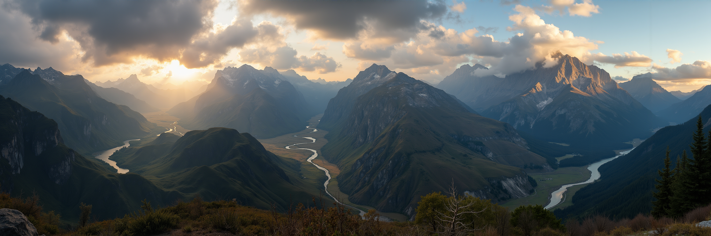

# MultiDiffusion Panorama for FLUX — training-free ultra-wide generation (Modular Diffusers custom block)

**🤗 Hub:** [remyxai/panorama-flux-modular](https://huggingface.co/remyxai/panorama-flux-modular) · **📄 Paper:** [arXiv:2302.08113](https://arxiv.org/abs/2302.08113) · **💻 Reference:** [omerbt/MultiDiffusion](https://github.com/omerbt/MultiDiffusion) *(unlicensed — see the clean-room note)* · **📦 Monorepo:** [flux-modular-diffusers](https://github.com/remyxai/flux-modular-diffusers)

Generate **ultra-wide / panoramic images well beyond FLUX's native aspect** — no training, no extra
weights — as a [Modular Diffusers](https://huggingface.co/docs/diffusers/main/en/modular_diffusers/custom_blocks)
custom block. Implements **MultiDiffusion** ([arXiv:2302.08113](https://arxiv.org/abs/2302.08113)):
the wide latent is denoised through overlapping **native-resolution windows**, and each window's
prediction is **averaged back into the shared canvas** every step, so the fused panorama is one globally
coherent scene rather than stitched tiles.



<sub>A single coherent wide scene — no repetition or seams at the window boundaries. Training-free.</sub>

## Usage

```python
import torch
from diffusers import ModularPipeline

pipe = ModularPipeline.from_pretrained("remyxai/panorama-flux-modular", trust_remote_code=True)
pipe.load_components(dtype=torch.bfloat16)
pipe.to("cuda")

panorama = pipe(
    prompt="a sweeping mountain ridge at golden hour, alpine lake in the foreground",
    height=1024, width=3072,     # 3:1 — go to 4096 for a full wrap
    window=1024, stride=512,     # native tile + 50% overlap
    num_inference_steps=28,
).images[0]
panorama.save("panorama.png")
```

`height`/`width` are the **full canvas**; the window/stride knobs control the tiling. Everything must be
a multiple of 16.

## How it works

One wide latent is the canvas. At every denoise step the canvas is cut into overlapping windows and the
FLUX transformer runs **once per window**; each window's velocity is scattered back into an accumulator
and divided by how many windows covered that position (**per-pixel mean** — the MultiDiffusion fusion
rule). The scheduler then advances the whole canvas once. Because windows overlap and are fused *before*
the step, content crosses window boundaries freely: no visible seams, no repeated subject per tile.

Two details make it work on FLUX flow-matching:

- **Per-window `img_ids`.** Each window gets native 2D position ids **offset to its origin** in the
  canvas, so local coordinates stay in-distribution while the offsets carry the global geometry.
- **The sigma schedule is computed at the window token count**, not the canvas token count. Every window
  is native-resolution, so the dynamic-shift `mu` must be shifted by the window's sequence length.

This is exactly the failure the windowed design avoids: denoising a single 3072-wide latent stretches the
position ids and the flow-match schedule far out of distribution, producing a smeared, textured
"woven blob". MultiDiffusion keeps every window at native resolution — the schedule stays sane, and the
image gets wide instead of mushy.

The transformer is never mutated (no attention-processor, hook, or pos_embed swap), so there is nothing
to restore after a run. VRAM stays near a native 1024×1024 generation per window; the wide latent is
held once. The VAE decode uses tiling (a 4K-class decode otherwise dominates memory).

## Key parameters

| arg | default | meaning |
|---|---|---|
| `width` | 3072 | full canvas width (ultra-wide: 2048–4096; multiple of 16) |
| `height` | 1024 | full canvas height (multiple of 16) |
| `window` | 1024 | window side in px — keep at FLUX's native 1024 |
| `stride` | 512 | window step in px; overlap = `window - stride` |
| `window_height` | None | window height in px; `None` = square `window`×`window` tiles |
| `guidance_scale` | 3.5 | FLUX guidance |
| `num_inference_steps` | 28 | denoise steps (applied to the whole canvas) |

**Tuning:** the overlap is the quality lever. `stride=512` (50% of a 1024 window) is a good default;
raise the overlap (lower the stride) if you see repeated content or a visible band at a boundary —
barely-overlapping windows repeat. Cost scales with the number of windows: a 3072×1024 canvas at
1024/512 is 5 window passes per step, so roughly 5× a native 1024×1024 step.

## Dependencies

`diffusers` (main / ≥ 0.40), `transformers`, `accelerate`, `sentencepiece`, `protobuf`. No extra
weights, no fine-tuning, no preprocessing models.

## Attribution & AI assistance

**MultiDiffusion** by Bar-Tal, Yariv, Lipman and Dekel. **Clean-room implementation:** the reference
repo [omerbt/MultiDiffusion](https://github.com/omerbt/MultiDiffusion) carries **no license**, so none of
its code was read or copied — this block was written from the paper's description alone (the method
itself is not copyrightable). The same fusion rule is cited in our
[regional-prompting](https://huggingface.co/remyxai/regional-prompting-flux-modular) card.

Authored with AI assistance (Claude) and validated by the Remyx AI team; method credit to the
MultiDiffusion authors. Uses FLUX.1-dev under its **non-commercial** license — this derivative inherits
that restriction.

## Citation

```bibtex
@misc{bartal2023multidiffusion,
  title={MultiDiffusion: Fusing Diffusion Paths for Controlled Image Generation},
  author={Bar-Tal, Dana and Yariv, Lior and Lipman, Yaron and Dekel, Tali},
  year={2023}, eprint={2302.08113}, archivePrefix={arXiv}, primaryClass={cs.CV},
  url={https://arxiv.org/abs/2302.08113}
}
```
