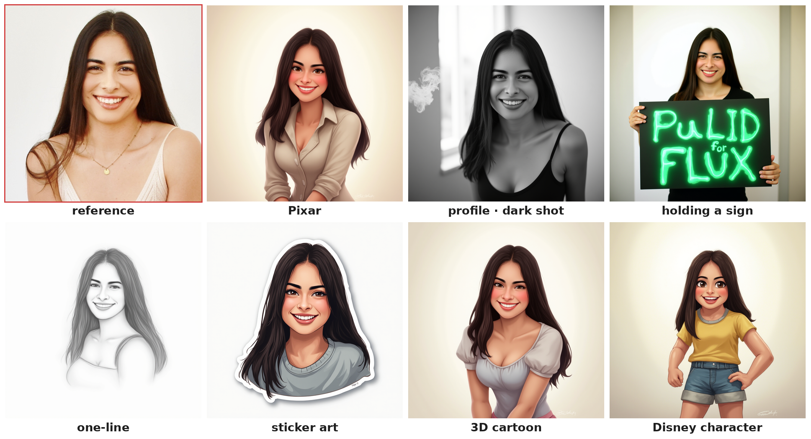

# PuLID for FLUX — training-free identity personalization (Modular Diffusers custom block)

**🤗 Hub:** [remyxai/pulid-flux-modular](https://huggingface.co/remyxai/pulid-flux-modular) · **📄 Paper:** [arXiv:2404.16022](https://arxiv.org/abs/2404.16022) · **💻 Reference:** [ToTheBeginning/PuLID](https://github.com/ToTheBeginning/PuLID) · **📦 Monorepo:** [flux-modular-diffusers](https://github.com/remyxai/flux-modular-diffusers)

Put a face into an off-the-shelf **FLUX.1-dev** generation — no fine-tuning, no LoRA — as a
[Modular Diffusers](https://huggingface.co/docs/diffusers/main/en/modular_diffusers/custom_blocks)
custom block. Implements **PuLID** ([arXiv:2404.16022](https://arxiv.org/abs/2404.16022)): an ID
embedding built from one reference face is injected as a cross-attention residual into FLUX during a
single denoise pass.

[](https://colab.research.google.com/drive/1nMRjBb98FpzguCzTapZznVPhvkXtfdS6?usp=sharing) — upload your own face and personalize in a few clicks.



<sub>One reference photo (top-left) → Pixar · dark-shot portrait · "holding a sign" · one-line sketch · sticker · 3D cartoon · Disney — identity preserved, all training-free from a single image.</sub>

## Usage

```python
import torch
from diffusers import ModularPipeline

pipe = ModularPipeline.from_pretrained("remyxai/pulid-flux-modular", trust_remote_code=True)
pipe.load_components(dtype=torch.bfloat16)
pipe.to("cuda")

img = pipe(
    prompt="portrait of a person as an astronaut, cinematic lighting",
    id_image="face.png",     # reference face: path / PIL / numpy RGB
    id_weight=1.0,           # 0..3 (≈1.0 recommended)
    height=1024, width=1024, guidance_scale=4.0,
).images[0]
img.save("pulid.png")
```

**Dependencies** (the ID encoder): `pip install insightface onnxruntime-gpu facexlib timm einops ftfy opencv-python`.
On first run it downloads EVA-CLIP, the antelopev2 face models, and the PuLID weights (`guozinan/PuLID`).
The vendored `eva_clip` is fetched from this repo at runtime and added to `sys.path`.

## Does it actually transfer identity?

ArcFace cosine similarity between the reference face and the generated face rises sharply with `id_weight`
(measured on an A100; `id_weight=0` is a bit-exact no-op = stock FLUX):

| `id_weight` | ArcFace cosine(reference, generated) |
|---|---|
| 0.0 | 0.03 |
| 0.5 | 0.46 |
| 1.0 | **0.76** |

## How it works

- **ID embedding** — InsightFace **ArcFace** (antelopev2) + facexlib align/parse + **EVA-CLIP** multi-scale
  features → a perceiver-resampler **IDFormer** → a (1, 32, 2048) identity embedding.
- **Injection** — the embedding is added as a cross-attention residual to the image stream after every
  **2nd double block** and every **4th single block** of FLUX (`img += id_weight · pulid_ca[k](id, img)`),
  via forward hooks on diffusers' `FluxTransformer2DModel` — the base weights are untouched and restored on exit.

This is the modular form of the reference; `id_weight=0` leaves stock FLUX bit-exact.

## Key parameters

| arg | default | meaning |
|---|---|---|
| `id_image` | — | reference face (path / PIL / numpy RGB); one clear face works best |
| `id_weight` | 1.0 | identity strength (0 = off, ~1.0 recommended, up to ~3) |
| `guidance_scale` | 4.0 | FLUX guidance |
| `num_inference_steps` | 20 | denoise steps |
| `height`, `width` | 1024 | multiples of 16 |

v1 uses fake-CFG (guidance-distilled single pass); true-CFG is a possible follow-up.

## Attribution & AI assistance

Training-free reimplementation for Modular Diffusers of **PuLID** (Apache-2.0,
[ToTheBeginning/PuLID](https://github.com/ToTheBeginning/PuLID); weights `guozinan/PuLID`); ID encoder uses
**EVA-CLIP** and **InsightFace**/**facexlib**. The Modular-Diffusers adaptation was authored with AI
assistance (Claude) and validated by the Remyx AI team; all method credit to the original authors.

## Citation

```bibtex
@misc{guo2024pulid,
  title={PuLID: Pure and Lightning ID Customization via Contrastive Alignment},
  author={Guo, Zinan and Wu, Yanze and Chen, Zhuowei and Chen, Lang and Zhang, Peng and He, Qian},
  year={2024},
  eprint={2404.16022}, archivePrefix={arXiv}, primaryClass={cs.CV},
  url={https://arxiv.org/abs/2404.16022}
}
```
