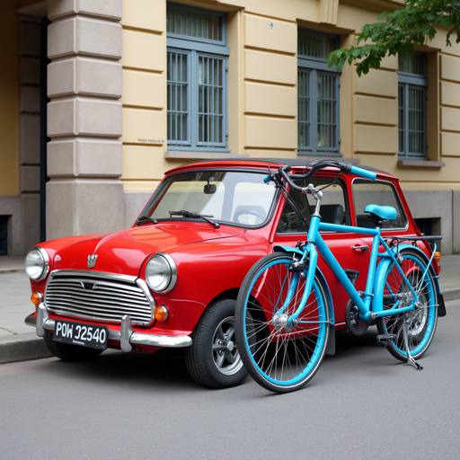

# Regional Prompting for FLUX — training-free spatial prompt control (Modular Diffusers custom block)

Put **different prompts in different regions** of one image — no fine-tuning — as a
[Modular Diffusers](https://huggingface.co/docs/diffusers/main/en/modular_diffusers/custom_blocks)
custom block. A base prompt sets the scene and each region gets its own prompt; a **joint-attention mask**
routes every image token to its region's text, so regions follow their own prompt. The SD version ships in
diffusers (`regional_prompting_stable_diffusion`); this is the FLUX (MMDiT) port.

[](https://colab.research.google.com/drive/1cqYRyGJWsqhO5GfBeARWTUkwEDtbYsCU?usp=sharing) — set a prompt per region and generate.



<sub>base: "two vehicles on a street" · left region → "a red vintage car" · right region → "a blue bicycle" —
each region follows its own prompt, training-free.</sub>

## Usage

```python
import torch
from diffusers import ModularPipeline

pipe = ModularPipeline.from_pretrained("remyxai/regional-prompting-flux-modular", trust_remote_code=True)
pipe.load_components(dtype=torch.bfloat16)
pipe.to("cuda")

img = pipe(
    base_prompt="two vehicles parked on a street, daytime",
    regions=[
        {"prompt": "a red vintage car", "bbox": [0.0, 0.0, 0.5, 1.0]},   # left half
        {"prompt": "a blue bicycle",    "bbox": [0.5, 0.0, 1.0, 1.0]},   # right half
    ],
    height=1024, width=1024,
).images[0]
img.save("regional.png")
```

`bbox` is normalized `[x0, y0, x1, y1]` in `[0,1]`. Regions can be any rectangles (columns, rows, quadrants…).

## How it works

The base prompt and each region prompt are encoded and concatenated into one text sequence. Each image token
is assigned to a region by its position in the latent grid, and a **joint-attention mask** lets that token
attend only to its region's text span (and the base for unassigned tokens) — so each region follows its own
prompt while sharing one coherent image. Training-free; the base weights are untouched (restored after the run).

## Key parameters

| arg | default | meaning |
|---|---|---|
| `base_prompt` | — | global scene prompt |
| `regions` | — | list of `{"prompt": str, "bbox": [x0,y0,x1,y1]}` (normalized) |
| `region_exclusive` | True | assigned tokens follow **only** their region's prompt (region dominates the base) |
| `region_isolate_strength` | 0.0 | off by default (cleanest look); raise to 1–3 **only** if two objects fuse into one (higher can introduce a boundary seam) |
| `region_seq_len` | 128 | text tokens per prompt (bounds the concatenated length) |
| `guidance_scale` | 3.5 | FLUX guidance |
| `num_inference_steps` | 28 | denoise steps |

## Attribution & AI assistance

FLUX (MMDiT) port of the regional-prompting technique. There is **no single canonical paper** — the approach
originates from hako-mikan's [Regional Prompter](https://github.com/hako-mikan/sd-webui-regional-prompter)
(Stable Diffusion web UI extension), ported to diffusers as the SD community pipeline
`regional_prompting_stable_diffusion`; this block adapts that masked-attention idea to FLUX's joint attention.
Authored with AI assistance (Claude) and validated by the Remyx AI team. Uses FLUX.1-dev under its
**non-commercial** license.

## References

- **Regional Prompter** — hako-mikan, <https://github.com/hako-mikan/sd-webui-regional-prompter> (technique origin)
- diffusers SD community pipeline `regional_prompting_stable_diffusion` (the port this adapts to FLUX)
- Related academic work on region-based diffusion — **MultiDiffusion**:

```bibtex
@misc{bartal2023multidiffusion,
  title={MultiDiffusion: Fusing Diffusion Paths for Controlled Image Generation},
  author={Bar-Tal, Omer and Yariv, Lior and Lipman, Yaron and Dekel, Tali},
  year={2023}, eprint={2302.08113}, archivePrefix={arXiv}, primaryClass={cs.CV},
  url={https://arxiv.org/abs/2302.08113}
}
```
