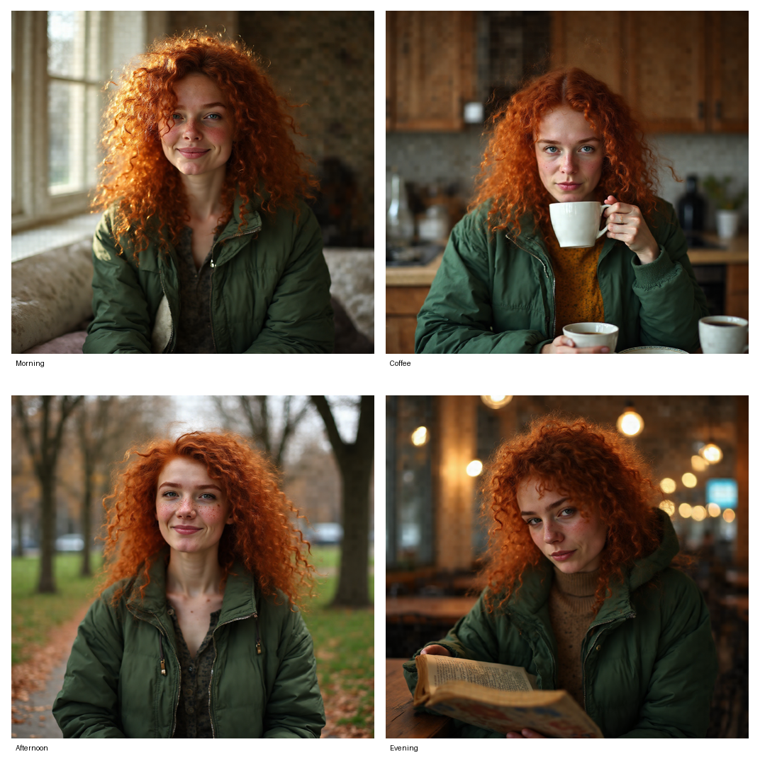

# StoryDiffusion for FLUX — training-free consistent-character generation (Modular Diffusers custom block)

**🤗 Hub:** [remyxai/story-diffusion-flux-modular](https://huggingface.co/remyxai/story-diffusion-flux-modular) · **📄 Paper:** [arXiv:2405.01434](https://arxiv.org/abs/2405.01434) · **💻 Reference:** [HVision-NKU/StoryDiffusion](https://github.com/HVision-NKU/StoryDiffusion) · **📦 Monorepo:** [flux-recipes](https://github.com/remyxai/flux-recipes)

Generate a **set of frames of the same character** across different scenes — no fine-tuning — as a
[Modular Diffusers](https://huggingface.co/docs/diffusers/main/en/modular_diffusers/custom_blocks)
custom block. Implements **StoryDiffusion**'s Consistent Self-Attention
([arXiv:2405.01434](https://arxiv.org/abs/2405.01434)) on FLUX: each frame also attends to the other frames,
so the character stays consistent while the scenes vary. Optional comic-sheet layout. Training-free.

[](https://colab.research.google.com/drive/1X7AP8OwxfNU-Zvck4d9cmNg8Tc4SBG54?usp=sharing) — make a consistent-character comic from your prompts.



<sub>One character (prompt) across Morning / Coffee / Afternoon / Evening scenes — consistent identity, distinct
scenes. Training-free.</sub>

## Usage

```python
import torch
from diffusers import ModularPipeline

pipe = ModularPipeline.from_pretrained("remyxai/story-diffusion-flux-modular", trust_remote_code=True)
pipe.load_components(dtype=torch.bfloat16)
pipe.to("cuda")

out = pipe(
    character_prompt="a young woman with curly red hair and freckles, green jacket",
    scene_prompts=[
        "waking up in a sunlit bedroom #Morning",       # "#..." -> panel caption
        "drinking coffee in a cozy kitchen #Coffee",
        "walking through a city park #Afternoon",
        "reading in a warm cafe at night #Evening",     # "[NC] ..." -> a scene without the character
    ],
    comic_layout="grid", comic_cols=2,
    height=1024, width=1024,
).images
sheet, panels = out[0], out[1:]      # comic_layout -> images[0] is the composed sheet
sheet.save("comic.png")
```

## How it works

The frames are generated together with a Consistent Self-Attention processor: each frame keeps its own tokens
and additionally attends to a **sampled fraction** (`share_ratio=0.3`) of the *other* frames' tokens, but only
**after the first ~third of steps** (`share_start_frac=0.35`) — so each scene's composition is set first, then
the shared character is locked in. This keeps scenes distinct while the character stays consistent. The base
weights are untouched (restored after). Scope: image consistency + comic compositor (no video; PhotoMaker
real-face identity is a possible v2 that pairs with [`remyxai/pulid-flux-modular`](https://huggingface.co/remyxai/pulid-flux-modular)).

## Key parameters

| arg | default | meaning |
|---|---|---|
| `character_prompt` | — | the subject description shared across frames |
| `scene_prompts` | — | list; `"#caption"` sets a panel caption; `"[NC]"` prefix = scene without the character |
| `share_ratio` | 0.3 | fraction of cross-frame tokens shared (↑ = more consistent, less scene diversity) |
| `share_start_frac` | 0.35 | share only after this fraction of steps (scene set first) |
| `comic_layout` | None | `"grid"` composes a captioned comic sheet (`images[0]`) |
| `guidance_scale` | 3.5 | FLUX guidance |

## Attribution & AI assistance

FLUX (MMDiT) port of **StoryDiffusion**'s Consistent Self-Attention
([HVision-NKU/StoryDiffusion](https://github.com/HVision-NKU/StoryDiffusion), Apache-2.0). Authored with AI
assistance (Claude) and validated by the Remyx AI team. Uses FLUX.1-dev under its **non-commercial** license.

## Citation

```bibtex
@misc{zhou2024storydiffusion,
  title={StoryDiffusion: Consistent Self-Attention for Long-Range Image and Video Generation},
  author={Zhou, Yupeng and Zhou, Daquan and Cheng, Ming-Ming and Feng, Jiashi and Hou, Qibin},
  year={2024}, eprint={2405.01434}, archivePrefix={arXiv}, primaryClass={cs.CV},
  url={https://arxiv.org/abs/2405.01434}
}
```
