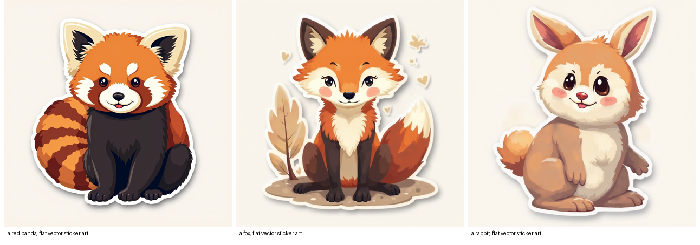

# StyleAligned for FLUX — training-free style-consistent set generation (Modular Diffusers custom block)

Generate a **set of images that share one coherent style** — no fine-tuning — as a
[Modular Diffusers](https://huggingface.co/docs/diffusers/main/en/modular_diffusers/custom_blocks)
custom block. Implements **StyleAligned** ([arXiv:2312.02133](https://arxiv.org/abs/2312.02133)) on FLUX:
the batch shares attention so every image adopts the style of the first (anchor) prompt while keeping its
own subject. Training-free; no extra weights.

[](https://colab.research.google.com/drive/1MyIY_KuV3kDkvftlb5YgBtv9IHknUfJd?usp=sharing) — pick a style + subjects and generate a matching set.



<sub>"a red panda / a fox / a rabbit, flat vector sticker art" — distinct subjects, one shared style. Training-free.</sub>

## Usage

```python
import torch
from diffusers import ModularPipeline

pipe = ModularPipeline.from_pretrained("remyxai/style-aligned-flux-modular", trust_remote_code=True)
pipe.load_components(dtype=torch.bfloat16)
pipe.to("cuda")

images = pipe(
    prompts=[
        "a red panda, flat vector sticker art",   # item 0 = the style anchor
        "a fox, flat vector sticker art",
        "a rabbit, flat vector sticker art",
    ],
    height=1024, width=1024,
).images
for i, im in enumerate(images):
    im.save(f"styled_{i}.png")
```

Put the style in every prompt; item 0 anchors it. `style_share=False` gives independent generations.

## How it works

The batch is generated together with a shared-attention processor: each image keeps its **own query**
(so its subject stays distinct), AdaIN-aligns its **keys** to item-0's statistics, and additionally attends
to item-0's **K/V** — but only in the **last ~20% of layers** (`share_start_frac=0.8`), where style lives.
Early/mid layers stay independent, so subjects don't collapse. The base weights are untouched (restored after).

## Key parameters

| arg | default | meaning |
|---|---|---|
| `prompts` | — | list of prompts sharing one style (item 0 = anchor) |
| `style_share` | True | False = independent generations |
| `share_start_frac` | 0.8 | share only the last `(1-frac)` of layers (lower = stronger style, risks subject collapse) |
| `guidance_scale` | 3.5 | FLUX guidance |
| `num_inference_steps` | 28 | denoise steps |

## Attribution & AI assistance

FLUX (MMDiT) port of **StyleAligned** ([google/style-aligned](https://github.com/google/style-aligned),
Apache-2.0). Authored with AI assistance (Claude) and validated by the Remyx AI team. Uses FLUX.1-dev under
its **non-commercial** license.

## Citation

```bibtex
@misc{hertz2023stylealigned,
  title={Style Aligned Image Generation via Shared Attention},
  author={Hertz, Amir and Voynov, Andrey and Fruchter, Shlomi and Cohen-Or, Daniel},
  year={2023}, eprint={2312.02133}, archivePrefix={arXiv}, primaryClass={cs.CV},
  url={https://arxiv.org/abs/2312.02133}
}
```
